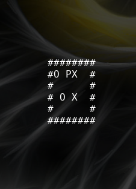

# PSU_my_sokoban_2017
Epitech's sokoban project

The goal was to implement sokoban game using ncurse librairy.

Usage: ./my_sokoban map_path

Maps should contains only:
X (movable blocks)
O (blocks destination)
P (player)
SPACE (empity case)
OTHERS (blocks)

Handle:
Game's end (either cannot move blocks or player won)
Open maps: Player can't leave it's space
Invalids maps
